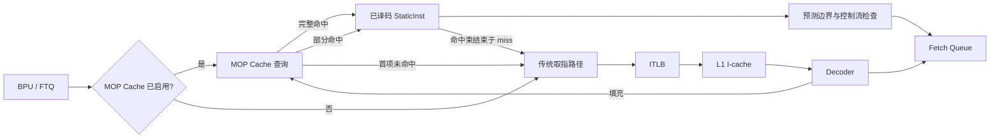

# MOP Cache 使用与架构说明

## 1. 概述

MOP Cache（Macro-Operation Cache）是 XiangShan O3 前端的一条额外取指来源。它缓存已经完成译码的 `StaticInst`，命中时直接向现有 fetch queue 提供指令，从而绕过 ITLB、L1 I-cache 访问和 decoder；未命中时回退到原有取指路径。

本实现是行为级性能模型，目标是保留以下性能因果链：

```text
正常取指并译码
  -> 向 MOP Cache 填充已译码指令
  -> 后续相同 PC 和体系结构上下文发起查询
  -> 命中后等待配置的查询延迟并占用读端口
  -> 向 fetch queue 提供指令，或在部分命中后回退到 I-cache
  -> 形成命中率、端口竞争、前端等待和 I-cache 流量变化
```

MOP Cache 默认关闭，因此不带 MOP Cache 参数的既有配置保持原行为。

## 2. 架构位置

MOP Cache 位于 FTQ/分支预测结果之后、ITLB/I-cache/decoder 之前。它使用 FTQ 给出的预测块结束地址约束查询范围，但命中指令仍经过现有的控制流检查、动态指令构造、fetch queue 和 FTQ 消耗路径。



主要代码位置：

- `src/cpu/o3/mop_cache.hh`：上下文、entry、查询结果和缓存接口。
- `src/cpu/o3/mop_cache.cc`：组相联查找、LRU、端口 token、填充和失效。
- `src/cpu/o3/fetch.cc`：查询时序、命中供应、回退、填充和统计。
- `src/cpu/o3/fetch.hh`：每线程 pending lookup 状态和统计定义。
- `src/cpu/o3/BaseO3CPU.py`：SimObject 参数。
- `configs/common/xiangshan.py`：命令行入口及 CPU 参数连接。
- `src/cpu/o3/commit.cc`：`fence.i` 提交时触发失效。

## 3. 缓存组织

### 3.1 Entry

每个 `MopEntry` 对应一个指令 PC，而不是一个可变长 trace。它保存：

| 字段 | 含义 |
| --- | --- |
| `pc` | 当前指令地址 |
| `nextPC` | 顺序执行时的下一条指令地址 |
| `staticInst` | 已译码的 `StaticInst` |
| `compressed` | 是否为 RISC-V 压缩指令 |
| `context` | 影响地址翻译或译码的上下文 |
| `valid` | entry 是否有效 |
| `lruSequence` | 真 LRU 的访问序号 |

以单 PC 为 entry 可以复用现有 `StaticInst` 和 fetch 控制流，避免在模型中复制完整的 trace/uop 数据流。

### 3.2 上下文匹配

命中要求 PC 和 `MopContext` 全部相同。上下文包含：

- thread ID；
- `satp`、`vsatp`、`hgatp`；
- 当前特权级；
- 虚拟化模式；
- vector `vtype` 是否就绪及其值。

这些字段避免不同地址空间、特权级、虚拟化状态或向量配置错误共享已译码指令。上下文按字段比较，不使用可能产生别名的压缩哈希作为正确性判断。

### 3.3 映射和替换

缓存是固定容量、组相联结构：

```text
numSets = entries / ways
setIndex = (pc >> 1) % numSets
```

RISC-V 指令至少两字节对齐，因此索引时丢弃恒为零的最低位。组内使用单调递增访问序号实现真 LRU；优先使用 invalid entry，否则替换 `lruSequence` 最小的 entry。

单次 entry 查找复杂度为 `O(ways)`；bundle 查询最多查找 `lookupWidth` 个 entry，因此复杂度上界为 `O(lookupWidth × ways)`。两个维度均由小型微结构参数限制，不存在无界热路径扫描。

## 4. 查询和供应流程

### 4.1 发起查询

当 fetch 线程满足以下条件时发起 MOP Cache 查询：

- MOP Cache 已启用；
- 当前不在展开 macro-op；
- 当前没有可直接消费的传统 fetch buffer；
- 该线程没有未完成的 MOP 查询；
- FTQ 非空。

查询键由当前 fetch PC 和 `MopContext` 组成，FTQ 的 `predEndPC` 作为独占的预测块结束边界。每个查询消耗一个 read-port token；当本周期 token 已耗尽时记录端口冲突，并在后续周期重试。

### 4.2 Bundle 查找

查询从起始 PC 顺序查找，最多返回 `lookupWidth` 个 entry。每命中一个 entry，就用它的 `nextPC` 查找下一项。查询在以下任一条件满足时停止：

- 到达 FTQ 的独占预测结束地址；
- 遇到第一个 miss；
- 达到 `lookupWidth`；
- 现有 fetch 宽度、fetch queue 容量、预测分支或向量配置等待阻止继续供应。

通过 `predEndPC` 约束 bundle，模型不会仅因缓存中存在后继 entry 就越过当前预测块。

### 4.3 查询延迟和陈旧响应

MOP Cache 核心立即完成有限组内查找，fetch 使用每线程 `MopLookupState` 将结果保持到：

```text
readyTick = clockEdge(mopCacheLookupLatency)
```

等待期间累计 `mopCachePendingCycles`。响应就绪后再次验证：

- FTQ head ID；
- 起始 PC；
- `MopContext`；
- squash version。

任一项变化都会丢弃响应并计入 `mopCacheStaleResponses`。squash、drain 等路径也会取消 pending lookup，避免错误路径结果进入流水线。

### 4.4 命中供应

命中的 `StaticInst` 复用 `processSingleInstruction()`，因此仍执行：

- RISC-V 压缩指令 PC 状态恢复；
- vector 配置相关 decoder 状态恢复；
-动态指令构造；
- 分支预测和下一 PC 更新；
- fetch queue 容量检查；
- FTQ 消耗和既有前端控制流。

MOP Cache 只替代“取指字节并重新译码”的来源，不创建第二套下游流水线语义。

### 4.5 Miss 和回退

- 首个 entry miss：查询延迟结束后直接进入传统 ITLB/I-cache 路径。
- 部分命中：先供应已命中的前缀，再从第一个 miss PC 进入传统路径。
- 完整命中并到达预测块边界：不发送对应的 I-cache 请求，计入 `mopCacheAvoidedICacheRequests`。
- 因 `lookupWidth` 停止但未到预测块末尾：可继续从新的 PC 发起下一次 MOP 查询。

当前模型采用串行策略：先等待 MOP 查询，确定 miss 后才回退到传统路径，而不是让 MOP Cache 与 ITLB/I-cache 并行竞争。因此更大的 `mopCacheLookupLatency` 会直接增加 miss 路径等待。

## 5. 填充流程

传统取指路径完成译码后，以当前 PC、下一 PC、`StaticInst`、压缩指令标志和译码时上下文填充 MOP Cache。

每周期只有 `mopCacheFillWidth` 个 fill token：

- 已有相同 PC 和上下文：更新 entry 并刷新 LRU；
- 组内存在 invalid entry：填入空闲位置；
- 组已满：替换 LRU entry；
- fill token 已耗尽：丢弃本次填充，不反压 decoder。

填充带宽不足被粗粒度建模为 drop，而不是新增填充队列。这保留了带宽不足会降低覆盖率和后续命中率的性能结果，同时避免引入并无独立外部行为的内部搬运状态。

## 6. 失效与正确性

以下事件会全局清空 MOP Cache，并取消所有线程的 pending lookup：

| 事件 | 触发位置 | 原因 |
| --- | --- | --- |
| `fence.i` 提交 | Commit | 指令存储内容可能已改变 |
| TLB flush | CPU | 地址翻译上下文可能已改变 |
| CPU takeover | Fetch/CPU 生命周期 | 新旧 CPU 状态不能共享缓存内容 |

此外，即使没有显式全局失效，查询仍要求完整上下文匹配，并在响应时重新检查上下文和 squash version。

MOP Cache 与 trace mode 不兼容；同时启用会直接 `fatal`，防止两条替代前端来源产生未定义的优先级关系。

## 7. 启用方法

### 7.1 编译

```bash
scons build/RISCV/gem5.opt --gold-linker -j64
```

### 7.2 Checkpoint 运行

MOP Cache 默认关闭。对普通 `.zstd` checkpoint slice 启用：

```bash
./build/RISCV/gem5.opt configs/example/kmhv3.py \
  --generic-rv-cpt=<checkpoint.zstd> \
  --enable-mop-cache
```

checkpoint slice 不需要添加 `--raw-cpt`。对于普通 raw checkpoint，仍按既有运行方式添加对应参数。

### 7.3 调整参数

```bash
./build/RISCV/gem5.opt configs/example/kmhv3.py \
  --generic-rv-cpt=<checkpoint.zstd> \
  --enable-mop-cache \
  --mop-cache-entries=2048 \
  --mop-cache-ways=8 \
  --mop-cache-lookup-width=8 \
  --mop-cache-lookup-latency=1 \
  --mop-cache-read-ports=2 \
  --mop-cache-fill-width=8
```

也可以在 Python 配置中直接设置：

```python
cpu.enableMopCache = True
cpu.mopCacheEntries = 2048
cpu.mopCacheWays = 8
cpu.mopCacheLookupWidth = 8
cpu.mopCacheLookupLatency = 1
cpu.mopCacheReadPorts = 2
cpu.mopCacheFillWidth = 8
```

## 8. 参数说明

| CLI 参数 | SimObject 参数 | 默认值 | 含义 |
| --- | --- | ---: | --- |
| `--enable-mop-cache` | `enableMopCache` | false | 启用 MOP Cache；默认值保持旧行为 |
| `--mop-cache-entries` | `mopCacheEntries` | 1024 | 总 entry 数 |
| `--mop-cache-ways` | `mopCacheWays` | 4 | 组相联路数 |
| `--mop-cache-lookup-width` | `mopCacheLookupWidth` | 8 | 单次查询最多返回的 entry 数 |
| `--mop-cache-lookup-latency` | `mopCacheLookupLatency` | 1 cycle | 从发起查询到结果可消费的延迟 |
| `--mop-cache-read-ports` | `mopCacheReadPorts` | 1 | 每周期可接受的查询数 |
| `--mop-cache-fill-width` | `mopCacheFillWidth` | 8 | 每周期最多接受的填充数 |

配置约束：

- `entries`、`ways`、`lookupWidth`、`readPorts` 和 `fillWidth` 必须非零；
- `entries` 必须能被 `ways` 整除；
- 非法配置会在初始化时抛出错误；
- `--enable-mop-cache` 不能与 `--enable-trace-mode` 同时使用。

调参时的预期趋势：

- 增加 `entries` 通常减少容量 miss；
- 增加 `ways` 通常减少冲突 miss，但每次查找的模拟复杂度随 ways 线性增加；
- 增加 `lookupWidth` 可让一次命中覆盖更多连续指令；
- 增加 `lookupLatency` 会增加 pending cycles，尤其会惩罚串行 miss 回退；
- 增加 `readPorts` 可减少 SMT 或多请求间的查询端口冲突；
- 增加 `fillWidth` 可减少 fill drop，但不会直接增加单次供应宽度。

## 9. Stats 与调试

统计位于 fetch stage，典型完整名称为 `system.cpu.fetch.<stat>`：

| Stat | 含义 |
| --- | --- |
| `mopCacheLookups` | 成功取得读端口并发起的查询数 |
| `mopCacheHits` | 命中的 entry 数，不是全 bundle 命中次数 |
| `mopCacheMisses` | bundle 查询遇到 miss 的次数 |
| `mopCacheSuppliedInsts` | 实际由 MOP Cache 送入现有 fetch 流程的指令数 |
| `mopCacheAvoidedICacheRequests` | 完整覆盖到预测块末尾而避免的 I-cache 请求数 |
| `mopCacheFallbackRequests` | miss 或部分命中后回退传统路径的次数 |
| `mopCachePendingCycles` | 等待查询结果的周期数 |
| `mopCachePortConflicts` | 因读端口 token 不足而拒绝的查询数 |
| `mopCacheFills` | 成功新增或更新的填充数 |
| `mopCacheFillDrops` | 因本周期填充带宽耗尽而丢弃的填充数 |
| `mopCacheEvictions` | 组满时发生的 LRU 替换数 |
| `mopCacheSquashedResponses` | 被 squash 取消的 pending 响应数 |
| `mopCacheStaleResponses` | FTQ、PC、上下文或版本不再匹配的响应数 |
| `mopCacheInvalidations` | 全局失效次数 |
| `mopCacheFenceIInvalidations` | 由 `fence.i` 触发的失效次数 |
| `mopCacheTlbInvalidations` | 由 TLB flush 触发的失效次数 |
| `mopCacheTakeoverInvalidations` | 由 CPU takeover 触发的失效次数 |

常用派生指标：

```text
entry hit rate = mopCacheHits / (mopCacheHits + mopCacheMisses)
fill drop rate = mopCacheFillDrops / (mopCacheFills + mopCacheFillDrops)
instructions per lookup = mopCacheSuppliedInsts / mopCacheLookups
```

第一项是 entry 级近似命中率：一次查询可能连续命中多个 entry 后再发生一次 miss，因此不要把 `mopCacheHits / mopCacheLookups` 当作概率。

启用 debug 输出：

```bash
./build/RISCV/gem5.opt \
  --debug-flags=MopCache \
  configs/example/kmhv3.py \
  --generic-rv-cpt=<checkpoint.zstd> \
  --enable-mop-cache
```

## 10. SPEC CPU 2017 test 规模验证

仓库提供 `util/xs_scripts/mop_cache_spec17.py`，用于固定 workload/simpoint、生成 MOP off/on 成对命令并汇总 stats。

生成默认四个测试点的 manifest：

```bash
python3 util/xs_scripts/mop_cache_spec17.py manifest \
  --workload-root ~/sim/workloads/spec-cpu-2017 \
  --output /tmp/mop-cache-spec17.list
```

默认测试点为：

- `gcc_r_test_cmd0/0`；
- `perlbench_r_test_cmd0/61`；
- `xalancbmk_r_test_cmd0/3`；
- `xz_r_test_cmd0/90`。

查看 paired off/on 运行命令：

```bash
python3 util/xs_scripts/mop_cache_spec17.py commands \
  --workload-root ~/sim/workloads/spec-cpu-2017 \
  --manifest /tmp/mop-cache-spec17.list
```

从运行目录的 `stats.txt` 提取默认指标：

```bash
python3 util/xs_scripts/mop_cache_spec17.py stats \
  <off-run>/stats.txt <on-run>/stats.txt
```

比较时至少检查：

- off/on 是否提交相同数量的指令；
- IPC 和周期数；
- I-cache accesses；
- MOP supplied instructions；
- pending cycles 和 fallback requests；
- fill drops、evictions 和 invalidations。

## 11. 模型粒度与精度边界

### 11.1 细粒度保留的行为

- 每条指令的 PC、下一 PC、压缩属性和已译码对象；
- 地址空间、特权级、虚拟化和 vector 配置上下文；
- 查询延迟、每周期读端口和填充带宽；
- partial hit、miss fallback、预测块边界和 fetch queue backpressure；
- squash、陈旧响应、`fence.i`、TLB flush 和 takeover 失效；
- LRU 替换及各类 drop/evict/blocked 统计。

这些行为会直接改变前端进度、I-cache 请求数、等待周期或正确性，因此需要细建。

### 11.2 粗粒度行为

- lookup 内部 tag/data pipeline 被合并为参数化固定延迟；
- 读端口和填充通路用每周期 token 表示，不复刻 RTL 仲裁信号；
- 填充带宽不足直接 drop，不建立独立 fill queue；
- entry 保存 `StaticInst`，不复制 RTL uop 编码和物理数据阵列；
- MOP 查询和传统 I-cache 路径采用串行选择，不模拟并行竞速或取消 I-cache 请求。

因此，该模型适合研究容量、相联度、查询宽度、固定延迟、端口带宽、填充覆盖率以及 I-cache 流量的趋势；它不表示某个具体 RTL MOP Cache 的逐拍结构、面积、能耗或并行 hit/miss 判定时序。

特别需要注意：当前串行查询策略可能在减少 I-cache accesses 的同时降低 IPC。若目标硬件让 MOP lookup 与传统取指并行，则应扩展模型的请求竞争和取消语义，而不能仅把 `mopCacheLookupLatency` 调小后宣称完成了 RTL 对齐。

## 12. 已完成的基础验证

- `build/RISCV/gem5.opt` 编译通过；
- RISCV unit-test target 通过，MOP Cache 新增测试 8/8 通过；
- 小容量配置会降低 hits 并增加 I-cache accesses；
- lookup latency 从 1 增至 2 时，pending cycles 增加且 IPC 下降；
- SPEC17 test 四组 paired run 均运行完成，MOP-on 能减少 I-cache accesses，但当前串行策略未获得 IPC 收益。

运行环境中缺少仓库约定的匹配 difftest reference；本地其他 NEMU reference 在 MOP-off 基线第一条指令即出现状态不匹配。因此现有 workload 结果使用 `--disable-difftest`，在具备匹配 reference 的环境中仍需补充正式 difftest 验证。
